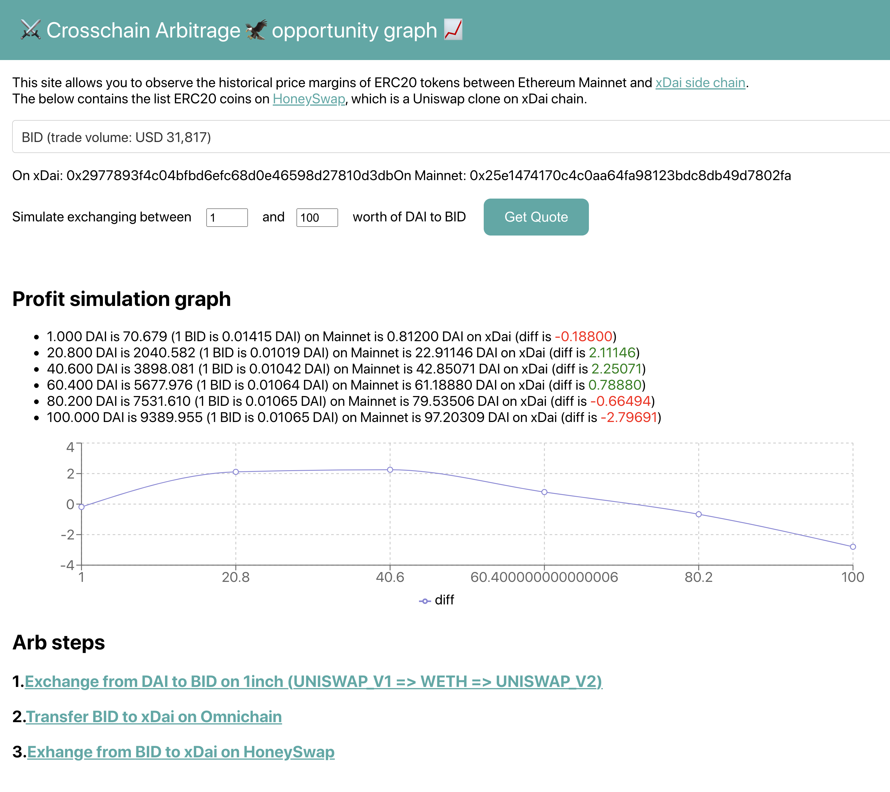

# ⚔️ Crosschain Arbitrage 🦅 opportunity graph 📈



Crosschain Arbitrage opportunity graph allows you to observe the historical price margins of ERC20 tokens between Ethereum Mainnet and Matic side chain.

- [Explainer video](https://www.youtube.com/watch?v=4cnzp29hk7s)
- [Demo site](https://matic-arb-graph.surge.sh)

## How to set up

```
git clone https://github.com/makoto/matic-arb-graph
cd  matic-arb-graph/packages/react-app
yarn
yarn start
```

## API used

- [1inch exchange](https://api.1inch.exchange/v2.0/swagger/#/Quote%2FSwap/getQuote) `quote` api to get best pass from DAI -> ERC20 token and add link to 1inch exchange page
- [xDAI AMB bridge contract](https://docs.tokenbridge.net/eth-matic-amb-bridge/about-the-eth-matic-amb) `foreignTokenAddress` to find equivalent token contract info on mainnet
- [TheGraph](https://thegraph.com/) to call 1hive and uniswap daily price info 

